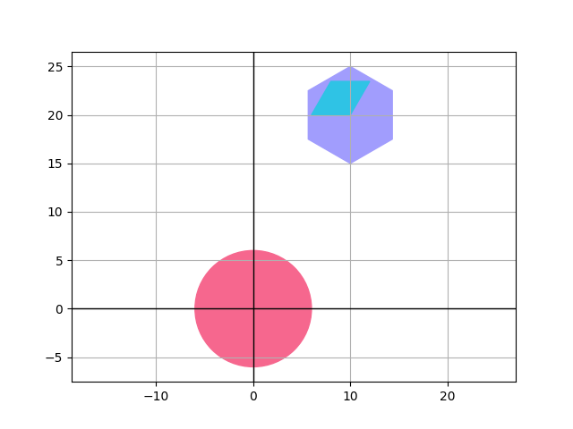
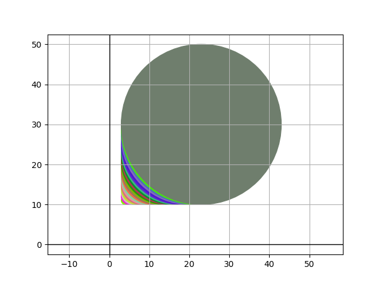

# Temat projektu
Język do opisu figur geometrycznych i ich właściwości.Podstawowe typy figur geometrycznych (trójkąt, prostokąt, romb,trapez,koło itd.) są wbudowanymi typami języka. Każdy typ posiada wbudowane metody służące do wyznaczania charakterystycznych dla niego wielkości, np. obwód, pole powierzchni, wysokość, średnica itp.Kolekcja figur tworzy scenę wyświetlaną na ekranie.

Wariant: `Język statycznie typowany z silnym typowaniem`

Język programowania: `Python`

# Opis funkcjonalności

Język do opisu figur geometrycznych i ich właściwości umożliwia opisanie i obliczanie charakterystycznych wielkości dla różnych typów figur geometrycznych.

Każdy typ figury geometrycznej jest reprezentowany przez swoje właściwości. Metody wbudowane umożliwiają wyznaczenie charakterystycznych dla danej figury wielkości. Wyniki obliczeń można wyświetlić na ekranie w formie tekstowej.

Kolekcja figur geometrycznych tworzy scenę, na której użytkownik może umieszczać figury i dokonywać na nich różnych operacji, takich jak skalowanie i przenoszenie

Figury geometryczne i ich charakterystyczne wielkości:

- Koło:
    - Promień (r) - odległość od środka koła do dowolnego punktu na jego obwodzie.
    - Średnica (d) - dwukrotność promienia.
- Kwadrat:
    - Bok (a) - długość każdej z czterech równych krawędzi.
    - Przekątna (d) - odległość między dwoma przeciwległymi wierzchołkami.
    - Promień okręgu wpisanego (r) i promień okręgu opisanego (R)
- Prostokąt:
    - Bok krótszy (a) i bok dłuższy (b) - długości dwóch przeciwległych krawędzi.
    - Przekątna (d) - odległość między dwoma przeciwległymi wierzchołkami.
    - Promień okręgu opisanego (R)
- Trójkąt:
    - Bok (a), bok (b) i bok (c) - długości trzech krawędzi.
    - Wysokość (h) - pionowa odległość między jednym z wierzchołków a przeciwległą krawędzią.
    - Promień okręgu wpisanego (r) i promień okręgu opisanego (R)
- Romb:
    - Bok (a) - długość każdej z czterech równych krawędzi.
    - Przekątna (e) i przekątna (f) - długości dwóch przeciwległych przekątnych.
    - Kąt między przekątnymi (α) - kąt pomiędzy przekątnymi, mierzony w stopniach.
    - Promień okręgu wpisanego (r)
- Trapez:
    - Bok (c) i bok (d) - długości dwóch równoległych krawędzi.
    - Wysokość (h) - pionowa odległość między dwoma równoległymi krawędziami.
    - Podstawa mniejsza (a) i podstawa większa (b) - długości dwóch pozostałych krawędzi.
    - Kąt wewnętrzne przy podstawie (α) i (β)
    - Promień okręgu wpisanego (r) i promień okręgu opisanego (R)
- Wielokąt formeny:
    - Bok (a) - długość każdej z krawędzi.
    - Liczba boków (n) - liczba krawędzi w wielokącie.
    - Kąt wewnętrzny (α) - kąt pomiędzy dwoma sąsiednimi krawędziami
    - Promień okręgu wpisanego (r) i promień okręgu opisanego (R)

- Shape, jest to figura nadrzędna, która będzie zawierała metody, które można wyznaczyć i wykonać na wszystkich figurach geometrycznych:
    - Pole powierzchni (area)
    - Obwód (perimeter)
    - Przesuń o wektor (move)

Kolekcja figur służąca do wyświetlania:

- Płótno (canvas)
    - dodawanie elementu do kolekcji (push)
    - usuwanie ostatnio dodanego elementu z kolekcji (pop)
    - wyświetlanie kolekcji (display)

Założenia dotyczące programu:
- Każda instrukcja musi być zakończona znakiem `;`
- Program musi zawierać funkcję `main()`, która jest funkcją startową
- Program składa się z bloków funkcji, które zawarte są między znakami `{`, `}`

# Wymagania funkcjonalne

1. Typowanie statyczne, silne typowanie, Mutowalność
2. Funkcję mogę być wywoływane rekursywnie
3. Zmienne widoczne są jedynie w blokach, poza nimi już nie
4. Rzutowanie wartości liczbowych, ucięcie cyfr po przecinku
5. W wywołaniach funkcji typy, przekazujemy przez referencję

# Wymaganie niefunkcjonalne

1. Język powinien działać na różnych platformach i systemach operacyjnych takich jak Windows, Linux i macOS
2. Język powinien być dobrze udokumentowany, wszystkie jego funkcjonaliści i sposób korzystania będzie opisany w dokumentacji
3. Język działa w sposób deterministyczny, zawsze zwraca te same wyniki
4. Zapewniamy bezpieczeństwo na poziomie, czytania kodu znak po znaku, ustawiając odpowiednie limity na zmiennych


# Semantyka

1. Typy danych:
- proste
    - `int` - typ liczby całkowita,
    - `dec` - typ zmienno przecinkowy (liczba dziesiętna - decimal)
    - `bool` - wartość logiczna (prawda/fałsz)
- złożone
    - `String` - ciąg znaków
    - `Shape` - figura, jest to typ nadrzędny, dla pozostałych figur
        - `area() -> dec` - metoda zwracająca pole powierzchni figury, dostępna dla każdej figury
        - `perimeter() -> dec` - metoda zwraca obwód figury, dostępna dla każdej figury
        - `move(x, y)` - metoda przesuwająca figurę o wektor, dostępna dla każdej figury
    - `Circle(x, y, r)` - koło
        - pierwsze dwa argumenty, to współrzędne punktu początkowego, mogą być typu dec
        - jako argumenty podajemy promień koła, promień może być typu dec z wartością dodatnią.
        - `r() -> dec` - metoda zwraca promień koła
        - `d() -> dec` - metoda zwraca średnicę koła
    - `Square(x, y, a)` - kwadrat
        - pierwsze dwa argumenty, to współrzędne punktu początkowego, mogą być typu dec
        - jako argumenty podajemy bok kwadratu, bok może być typu dec z wartością dodatnią.
        - `a() -> dec` - metoda zwraca bok kwadratu
        - `d() -> dec` - metoda zwraca przekątną kwadratu
        - `r() -> dec` - metoda zwraca promień okręgu wpisanego w kwadrat
        - `R() -> dec` - metoda zwraca promień okręgu opisanego na kwadracie
    - `Rectangle(x, y, a, b)` - prostokąt
        - pierwsze dwa argumenty, to współrzędne punktu początkowego, mogą być typu dec
        - jako argumenty podajemy boki kwadratu, boki mogą być typu dec z wartością dodatnią
        - `a() -> dec` - metoda zwraca bok pierwszy prostokąta
        - `b() -> dec` - metoda zwraca bok drugi prostokąta
        - `d() -> dec` - metoda zwraca przekątną prostokąta
        - `R() -> dec` - metoda zwraca promień okręgu opisanego na prostokącie
    - `Triangle(x, y, a, b, alfa)` - trójkąt
        - pierwsze dwa argumenty, to współrzędne punktu początkowego, mogą być typu dec
        - jako argumenty podajemy dwa boki trójkąta i kąt pomiędzy nimi, boki mogą być typu dec z wartością dodatnią, kąt też jest typu dec.
        - `a() -> dec` - metoda zwraca bok pierwszy trójkąta
        - `b() -> dec` - metoda zwraca bok drugi trójkąta
        - `c() -> dec` - metoda zwraca bok trzeci trójkąta
        - `alfa() -> dec` - metoda zwraca kąt pomiędzy bokami `a()` i `b()` trójkąta
        - `beta() -> dec` - metoda zwraca kąt pomiędzy bokami `b()` i `c()` trójkąta
        - `gamma() -> dec` - metoda zwraca kąt pomiędzy bokami `c()` i `a()` trójkąta
        - `h() -> dec` - metoda zwraca wysokość trójkąta
        - `r() -> dec` - metoda zwraca promień okręgu wpisanego w trójkąt
        - `R() -> dec` - metoda zwraca promień okręgu opisanego na trójkącie
    - `Rhomb(x, y, a, alfa)` - romb
        - pierwsze dwa argumenty, to współrzędne punktu początkowego, mogą być typu dec
        - jako argumenty podajemy bok rombu i kąt pomiędzy nimi, bok może być typu dec z wartością dodatnią, kąt też jest typu dec.
        - `a() -> dec` - metoda zwraca bok rombu
        - `alfa() -> dec` - metoda zwraca kąt pierwszy pomiędzy bokami rombu
        - `beta() -> dec` - metoda zwraca kąt drugi pomiędzy bokami rombu
        - `e() -> dec` - metoda zwraca pierwszą przekątną rombu
        - `f() -> dec` - metoda zwraca drugą przekątną rombu
        - `r() -> dec` - metoda zwraca promień okręgu wpisanego w romb
    - `Trapeze(x, y, a, b, c, alfa)` - trapez
        - pierwsze dwa argumenty, to współrzędne punktu początkowego, mogą być typu dec
        - jako argumenty podajemy dwie podstawy trapezu, bok i ką jaki tworzy ten bok z dłuższą podstawą, boki mogą być typu dec z wartością dodatnią, kąt też jest typu dec.
        - `a() -> dec` - metoda zwraca pierwszą podstawę trapezu
        - `b() -> dec` - metoda zwraca drugą podstawę trapezu
        - `c() -> dec` - metoda zwraca pierwszy bok trapezu
        - `d() -> dec` - metoda zwraca drugi bok trapezu
        - `alfa() -> dec` - metoda zwraca kąt pomiędzy bokiem `c()` a podstawą `a()` trapezu
        - `beta() -> dec` - metoda zwraca kąt pomiędzy bokiem `d()` a podstawą `a()` trapezu
        - `h() -> dec` - metoda zwraca wysokość trapezu
        - `r() -> dec` - metoda zwraca promień okręgu wpisanego w trapez
        - `R() -> dec` - metoda zwraca promień okręgu opisanego na trapezie
    - `Polygon(x, y, a, n)` - wielokąt foremny
        - pierwsze dwa argumenty, to współrzędne punktu początkowego, mogą być typu dec
        - jako argumenty podajemy bok i ilość boków, bok może być typu dec z wartością dodatnią, natomiast ilość boków może być typu int.
        - `a() -> dec` - metoda zwraca bok wielokąta
        - `n() -> int` - metoda zwraca ilość boków wielokąta
        - `alfa() -> dec` - metoda zwraca kąt pomiędzy bokami wielokąta
        - `r() -> dec` - metoda zwraca promień okręgu wpisanego w wielokąt
        - `R() -> dec` - metoda zwraca promień okręgu opisanego na wielokącie
    - `Canvas()` - kolekcja figur
        - do kolekcji możemy dodawać figury `push(shape)`
        - usuwanie elementu z kolekcji `pop()`
        - wyświetlanie kolekcji `display()`
2. operatory arytmetyczne:
- `+` - dodawanie
- `-` - odejmowanie
- `*` - mnożenie
- `/` - dzielenie
3. operatory logiczne:
- `and` - koniunkcja
- `or` - alternatywa
- `not` - negacja
4. operatory porównania:
- `>` - większy
- `>=` - większy równy
- `<` - mniejszy
- `<=` - mniejszy równy
- `==` - równy
- `!=` - nierówny
5. instrukcja warunkowa:
- `if`:
```c++
if (warunek){

} else {

};
```
6. pętle
- `while` - pętla warunkowe
```c++
while (warunek) {

};
```
- `for` - pętla iterująca po elementach kolekcji

```c++
Canvas canvas = Canvas();
for ( Shape shape : canvas){

};
```
7. Funkcje. Jeżeli funkcja zwraca wartość musi rozpoczynać się od typu, który zwraca, natomiast, jeżeli funkcja nic nie zwraca musi on zaczynać się od słowa `def`
```c++
def Rectangle nazwa( int a, dec b){
    Circle circle = Circle(a);
    print(circle.area());
    return Rectangle(a, b);
};

def nazwa(Rectangle r){
    print(r.area());
};
```
8. Komentarze, umożliwiamy komentarze w jednej linii
```python
# to jest komentarz
```
9. Deklaracja zmiennych, umożliwiamy przypisywanie nowej wartości do zmiennych
```c++
bool isSquare = False;
bool isCircle = True;
bool isRect = isSquare;
isCircle = isRect;
```
10. instrukcja print, służąca do wypisywania tekstu na ekranie
```python
Triangle t = Triangle(3.0, 4.0, 55.0);
print(t.area());
```
# Tokeny

```py
ADD = "+"
SUBTRACT = "-"
MULTIPLY = "*"
DIVIDE = "/"

ASSIGN = "="

AND = "and"
OR = "or"
NOT = "not"

EQUAL = "=="
NOT_EQUAL = "!="
GREATER = ">"
LESS = "<"
GREATER_EQUAL = ">="
LESS_EQUAL = "<="

COMMENT = "#"

INTEGER = "int"
DECIMAL = "dec"
BOOL = "bool"

BOOL_TRUE = "True"
BOOL_FALSE = "False"

STRING = "String"
STRING_QUOTE = "\""

SHAPE = "Shape"
CIRCLE = "Circle"
SQUARE = "Square"
RECTANGLE = "Rectangle"
TRIANGLE = "Triangle"
RHOMB = "Rhomb"
TRAPEZE = "Trapeze"
POLYGON = "Polygon"
CANVAS = "Canvas"

SEMICOLON = ";"
COLON = ":"
COMMA = ","
DOT = "."

FUNCTION = "def"
RETURN = "return"

START_CURLY = "{"
STOP_CURLY = "}"
START_ROUND = "("
STOP_ROUND = ")"
START_SQUARE = "["
STOP_SQUARE = "]"

IF = "if"
ELSE = "else"

WHILE = "while"
FOR = "for"

UNDEFINED = "undefined"
IDENTIFIER = "identifier"
EOF = "eof"
```

# Gramatyka
```EBNF
program             = {fun_declaration};
argument_dec        = type, identifier;
argument_list       = argument_dec, {',', argument_dec};
fun_declaration     = "def", [type], identifier,
                    '(', [argument_list], ')', block;
block               = '{',  {statement}, '}';

statement           = if_statement | while_statement
                    | iterate_statement | return_statement
                    | declaration | expression;

if_statement        = "if", "(", logical_expression, ")", block,
                    ["else", block] ;
while_statement     = "while", '(', logical_expression, ')', block;
iterate_statement   = "for", '(', argument_dec, ':',
                    expression, ')', block;
return_statement    = "return", expression, ';';
declaration         = argument_dec, ['=', expression], ';';
assignment_or_exp   = [identifier, '='], expression, ';';

logical_expression  = or_expression;
or_expression       = and_expression, {or_operator, and_expression};
and_expression      = relative_expression,
                    {and_operator, relative_expression};
relative_expression = sub_expression, {relative_operator, sub_expression};
sub_expression      = mul_expression, {subtract_operator, mul_expression};
mul_expression      = factor, {multiply_operator, factor};
factor              = ["-" | "not"], (string | number | bool | expression)

expression          = expression_call
expression_call     = simple_expression, ".", identifier, function_arg
function_arg        = "(" [expression, {',', expression}] ")";
simple_expression   = id_or_fun_call | cast_or_expression
id_or_fun_call      = identifier | type, [function_arg];
cast_or_expression  = "(", ("int" | "dec") |  expression, ")";


subtract_operator   = '+' | '-';
multiply_operator   = '*' | '/';
relative_operator   = '>' | '>=' | '<' | '<=' | '==' | '!=';
or_operator         = 'or';
and_operator        = 'and';
access_operator     = '.';

type                = simple_type | complex_type;
simple_type         = "int" | "dec" | "bool";
complex_type        = "Shape" | "Circle" | "Square"
                    | "Rectangle" | "Triangle"| "Rhomb"
                    | "Trapeze" | "Polygon" | "Canvas";

identifier          = letter, {letter | digit};

string              = '"', {chars}, '"';
comment             = '#', {chars}, '\n' | '\r' | '\n\r' | '\n\n';
chars               = letter | digit;

number              = integer | decimal;
integer             = zero | (not_zero_digit, {digit});
decimal             = integer, '.', digit, {digit};
bool                = "True" | "False";

digit               = zero | not_zero_digit;
not_zero_digit      = "1" | "2" | "3" | "4" | "5" | "6" | "7" | "8" | "9" ;
zero                = '0';
letter              = #'[a-z]' | #'[A-Z]' (*inne znaki specjalne*);
```

# Obsługa błędów:

- Napotkanie błędu powoduje wyświetlenie odpowiedniego komunikatu użytkownikowi.

Komunikat składa się z numera wiersza lini oraz numera kolumny w którym dany błąd wystąpił, następnie wyświetlana jest treść komunikatu.

Napotkanie błędu nie powoduje zakończenia pracy programu, dopiero napotkanie błędu krytycznego, kończy działanie problemu.

Błędy podzielone są na trzy kategorie, w zależności od tego w którym miejscu wystąpią, w ramach analizatora leksykalnego możemy napotkać błędy `LexerError`, a w analizatorze składniowym `ParserError`, błędy te nie powodują zatrzymania pracy programu, tylko zapisywane są w `ErrorManager` i wyświetlane na końcu działania programu.
Natomiast błędy semantyczne, które mogą wystąpić w analizatorze semantycznym: `InterpreterError`, powodują zatrzymanie pracy programu, i wyświetlenie komunikatu użytkownikowi.

Przykładowe błędy, które mogą wystąpić w programie:

- `błędny leksykalne`

Kod:
```cpp
def main(){
    int x = 123123123123;
}
```
Komunikat błędu:
```cpp
LexerError [2, 14]: Type 'int' value out of range. : [1]
```
Kod:
```cpp
def main(){
    int x = 123$123;
}
```
Komunikat błędu:
```cpp
LexerError [2, 16]: Unexpected character. : [$]
```
- `błędy składniowe`

Kod:
```cpp
def main() {
   printf("HI")
}
```
Komunikat błędu:
```cpp
ParserError [3, 2]: Unexpected token. : [}] expected: [;]
```
Kod:
```cpp
def main() {
   int x 0;
}
```
Komunikat błędu:
```cpp
ParserError [2, 10]: Unexpected token. : [0] expected: [;]
```
Kod:
```cpp
def main() {
   int x = 1 + (2  2);
}
```
Komunikat błędu:
```cpp
ParserError [2, 20]: Unexpected token. : [2] expected: [)]
```
- `błędy semantyczne`

Kod:
```cpp
int a = 1;
bool b = False;
int c = a + b;
```
Komunikat błędu:
```cpp
InterpreterError [3, 15]: Mismatched types. : [int] + [bool]
```
Kod:
```cpp
int a = 1;
int b = 0;
dec c = a / b;
```
Komunikat błędu:
```cpp
InterpreterError [3, 15]: Division by zero.
```
Kod:
```cpp
def pow(int a){
    return a * a;
}
def main(){
    pow(True);
}
```
Komunikat błędu:
```cpp
InterpreterError [5, 15]: Mismatched types in call [pow]. : [bool] expected: [int]
```
# Sposób Uruchomiania

Program można uruchomiać za pomocą programu napisanego w języku python podając odpowiednie do argumenty przy jego wywołaniu.

Do poprawnego działania wymagany jest zainstalowany `Python` w wersji `3.9.0`, a także zainstalowane wymagane biblioteki znajdujące się w pliku `requirements.txt`.

Sposób instalacji: `pip3 install -r requirements.txt`.

Przykładowy sposób uruchomienia:

```bash
$ ./main.py code.txt
```

Wynik programu:
- wyświetlenie się nowego okna, na którym narysowane są figury
- wypisanie tekstu w konsoli

# Testowanie

Projekt zawiera testy jednostkowe oraz testy integracyjne, sprawdzające poprawność działającego kodu jak i programu.

Wykorzystywana biblioteka: `pytest`

Wszystkie testy znajdują się w folderze [tests](./src/test/), są one podzielone na trzy grupy, testy lexera, parsera i interpretera, w ramach których znajdują się sparametryzowane testy

Testy podzielone sa na kilka kategorii:
- działanie analizatora leksykalnego, czy podany kod został przetworzony, na poprawną listę tokenów, oczywiście będą sprawdzane też przykłady wymienione w sekcji `Obsługa błędów`:

Kod:
```cpp
1.0
2.0
312
```
Przykładowy Wynik:
```c++
TokenType.DECIMAL_VALUE.name,
TokenType.DECIMAL_VALUE.name,
TokenType.INTEGER_VALUE.name,
```

Kod:
```cpp
"asd
```
Przykładowy Wynik:
```cpp
UnterminatedStringError
```
- działanie analizatora składniowego, czy listę tokenów został przetworzony na poprawne drzewo składniowe, oczywiście będą sprawdzane też przykłady wymienione w sekcji `Obsługa błędów`

- Test popranie działającego programu:
```cpp
int x;
```
Oczekiwany wynik:
```cpp
DeclarationStatement(Position(1, 9), (Int, "x")
```

- Test programu zawierającego błąd składniowy
```cpp
def main() {
    if ( {
        int x = 1;
    }
}
```
Oczekiwany wynik:
```cpp
MissingExpressionError
```
- działanie analizatora semantycznego, czy program poprawnie działa, czy rzucane są odpowiednie wyjątki, oczywiście będą sprawdzane też przykłady wymienione w sekcji `Obsługa błędów`

- Test popranie działającego programu:
```cpp
def main(){
    print("WORKS");
}
```
Oczekiwany wynik:
```cpp
WORKS
```

```cpp
def main(){
    Circle c = Circle(0.0,0.0);
}
```
Oczekiwany wynik:
```cpp
NumberOfArgumentError
```
- Do testów zostaną załączone oczywiście wszystkie przykładowe fragmenty kodu podane w sekcji `przykłady wykorzystania języka`, a także te z sekcji `Obsługa błędów`

# Biblioteki

- `matplotlib` - biblioteka służąca do wyświetlania figur geometrycznych i nie tylko na ekranie
- `pytest` - biblioteka służąca do pisania testów w języku python
- `typing` - biblioteka umożliwiająca definiowanie typów zmiennych i argumentów funkcji w celu poprawy czytelności i jakości kodu
- `math` - biblioteka zawierająca funkcje matematyczne
- `enum` - biblioteka umożliwiająca definiowanie i wykorzystywanie typów wyliczeniowych

# Sposób realizacji


## Analizator leksykalny
Analizator leksykalny, znajdujący się w pliku [lexer.py](./src/lexer/lexer.py) jest odpowiedzialny za przetworzenie kodu źródłowego na sekwencję tokenów. Przetwarza strumień danych znak po znaku zwracając odpowiednie tokeny. Metoda `lexer.next_token()` zwraca kolejny token.

Tokeny są podstawowymi jednostkami składniowymi w języku programowania, takimi jak identyfikatory, słowa kluczowe, symbole, liczby, czy też znaki specjalne ich implementacja znajduje się w pliku [token_manager.py](./src/lexer/token_manager.py).

Przykładowy sposób wywołania analizatora leksykalnego:
```py
lexer = Lexer(stream, ErrorManager())
while lexer.next_token().token_type.name != TokenType.EOF.name:
    pass
```

# Analizator składniowy
Analizator składniowy, znany również jako parser, ma za zadanie sprawdzić, czy sekwencja tokenów jest zgodna z gramatyką języka programowania. Gramatyka określa zasady składniowe języka, takie jak kolejność tokenów i ich struktura.

Analizator składniowy, znajdujący się w pliku [parser.py](./src/parser/parser.py) pobiera kolejne tokeny z analizatora leksykalnego i na tej podstawie, token po tokenie tworzy drzewo składniowe, które reprezentuje strukturę gramatyczną kodu źródłowego, `parser.parse_program()` jest metodą odpowiedzialną za tworzenie drzewa składniowego. Obiekty jakie mogą zostać utworzone, znajdują się w folderze [objects](./src/parser/objects)

Aby pominąć komentarze, została utworzona warstwa pośrednia `LexerForParser, znajdująca się w pliku [lexer_for_parser.py](./src/lexer/lexer_for_parser.py), która filtruje tokeny, usuwając komentarze, a następnie przekazuje je do analizatora składniowego.

Przykładowy sposób wywołania analizatora składniowego:
```py
lexer = LexerForParser(stream_input, ErrorManager())
parser = Parser(lexer, ErrorManager())
tree = parser.parse_program()
```
# Analizator semantyczny

Analizator semantyczny przeprowadza analizę semantyczną na drzewie składniowym wygenerowanym przez analizator składniowy. Jego głównym zadaniem jest sprawdzenie poprawności użycia zmiennych, typów danych i wyrażeń w kodzie programu.

Analizator semantyczny znajdujący się w pliku [interpreter.py](./src/interpreter/interpreter.py) sprawdza, czy wszystkie odwołania do zmiennych są poprawne, czy typy danych są zgodne i czy wyrażenia są używane w prawidłowy sposób. W przypadku wykrycia błędów semantycznych, generuje odpowiednie komunikaty o błędach lub ostrzeżenia. Analiza semantyczna pozwala zapewnić logiczną poprawność kodu źródłowego przed wykonaniem programu.

Wynikiem działania analizatora semantycznego jest wyświetlenie obrazu na ekranie, a także wypisanie tekstu w konsoli.

Przykładowy sposób wywołania analizatora semantycznego:
```py
lexer = LexerForParser(stream_input, ErrorManager())
parser = Parser(lexer, ErrorManager())
Interpreter(parser).interpret()
```
# przykłady wykorzystania języka

- definiowanie typów
```c++
def main() {
    int a = 2;
    int b = a;
    dec c = 2.95;
    bool d = False;

    String string = "Hello World!";
    dec negative = -1.5;

    int x = a * (b + (int) c);
}
```

- wyznaczanie pola, obwodu, przekątnej, przesuwanie o wektor figury
```c++
def main() {
    Triangle t = Triangle(0.0, 0.0, 3.0, 4.0, 55.0);
    print(t.area());

    Rectangle r = Rectangle(0.0, 0.0, 5.0, 4.0);
    print(r.perimeter());

    Square s = Square(0.0, 0.0, 5.0);
    print(s.d());

    s.move(2.0, 3.0);
}
```
- dodawanie/usuwanie figur do/z kolekcji i wyświetlanie ich
```c++
def main(){
    Canvas c = Canvas();
    Circle circle = Circle(0.0, 0.0, 6.0);
    Polygon p = Polygon(10.0, 20.0, 5.0, 6);
    Rhomb r = Rhomb(6.0, 20.0, 4.0, 60.0);
    Trapeze t = Trapeze(8.0, 9.0, 6.0, 8.0, 6.0, 90.0);
    c.push(circle);
    c.push(p);
    c.push(r);
    c.push(t);
    c.pop();
    c.display();
}
```
Wynik działania programu:


- pętle, instrukcje warunkowe i iterowanie po kolekcji
```c++
def main(){
    Rectangle r = Rectangle(0.0, 0.0, 5.0, 4.0);
    dec r_per = r.perimeter();

    Square s = Square(0.0, 0.0, 5.0);
    dec s_per = s.perimeter();

    dec suma = 0.0;

    if ( s.area() != 2.5 or r_per == 2.0) {
        print(s.d());
    }

    if (r_per > s_per) {
        print("Prostokąt większy");
    } else {
        suma = r_per + s_per;
        print(suma);
    }

    dec i = 0.0;
    Canvas c = Canvas();
    while ( i <= 20.0 ) {
        c.push(Circle(i, i, i));
        i = i + 1.0;
    }

    for ( Shape shape : c) {
        shape.move(3.0, 10.0);
    }

    c.display();
}
```
Wynik działania programu:


- definiowanie funkcji i rekursywne wywołanie
```c++
def Square gasket(dec x, dec y, dec dim, Canvas c){
    if ( dim < 8.0) {
        return Square(x, y, dim);
    } else {
        dec new_dim = dim / 2.0;
        gasket(x, y, new_dim, c);
        gasket(x + new_dim, y, new_dim, c);
        gasket(x + new_dim, y + new_dim, new_dim, c);
    }
}

def Triangle getTriangle(dec x, dec y, dec height, dec width){
    return Triangle(x, y, width / 2.0, height, 90.0);
}

def printInformation(Triangle shape){
    # pole
    print(shape.area());
    # obwód
    print(shape.perimeter());
}

def main(){
    Canvas c = Canvas();
    c.push(gasket(0.0, 0.0, 248.0, c));
    c.display();
    Triangle t = getTriangle(0.0, 10.0, 20.0, 30.0);

    printInformation(t);
}
```


# Autor

Mateusz Brzozowski, 310608